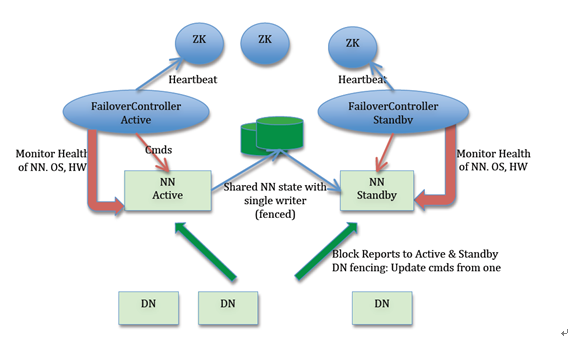

## Hadoop HA介绍

1. **Active NameNode 和 Standby NameNode**：两台 NameNode 形成互备，一台处于 Active 状态，为主 NameNode，另外一台处于 Standby 状态，为备 NameNode，只有主 NameNode 才能对外提供读写服务；
2. **ZKFailoverController（主备切换控制器，FC）**：ZKFailoverController 作为独立的进程运行，对 NameNode 的主备切换进行总体控制。ZKFailoverController 能及时检测到 NameNode 的健康状况，在主 NameNode 故障时借助 Zookeeper 实现自动的主备选举和切换（当然 NameNode 目前也支持不依赖于 Zookeeper 的手动主备切换）；
3. **Zookeeper 集群**：为主备切换控制器提供主备选举支持；
4. **共享存储系统**：共享存储系统是实现 NameNode 的高可用最为关键的部分，共享存储系统保存了 NameNode 在运行过程中所产生的 HDFS 的元数据。主 NameNode 和备 NameNode 通过共享存储系统实现元数据同步。在进行主备切换的时候，新的主 NameNode 在**确认元数据完全同步之后才能继续对外提供服务**。
5. **DataNode 节点**：因为主 NameNode 和备 NameNode 需要共享 HDFS 的数据块和 DataNode 之间的映射关系，为了使故障切换能够快速进行，DataNode 会同时向主 NameNode 和备 NameNode 上报数据块的位置信息。